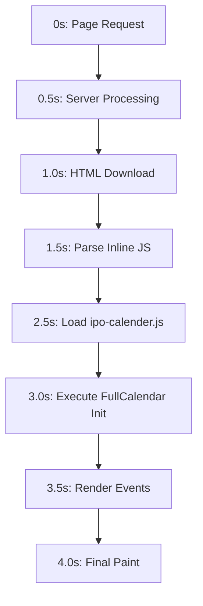

# IPO Calendar Page Performance Analysis

**Page:** `node--ipo-calendar.html.twig`  
**JavaScript:** `ipo-calender.js`  
**Current Render Time:** >4 seconds  
**Target:** <2 seconds

---

## Executive Summary

The IPO calendar page is experiencing significant performance degradation (>4 seconds load time) due to multiple architectural and implementation issues. The primary bottlenecks include:

1. Massive inline JavaScript generation in Twig template
2. Outdated, unoptimized FullCalendar library (v1.6.4 from 2013)
3. Synchronous DOM manipulation and rendering
4. Large JavaScript file size (~370KB with embedded library)
5. No code splitting or lazy loading

---

## Critical Performance Bottlenecks

### 1. **Inline JavaScript Generation in Twig Template**
**Severity:** HIGH  
**Impact:** 1-2 seconds

**Location:** [`node--ipo-calendar.html.twig:91-148`](themes/custom/fivepaisa/templates/node/node--ipo-calendar.html.twig:91)

```twig
<script>
    ipoData = [];
    
    
        var ipoOpenEntry = { ... };
        ipoData.push(ipoOpenEntry);
        
            var ipoListingEntry = { ... };
            ipoData.push(ipoListingEntry);
        
        var ipoCloseEntry = { ... };
        ipoData.push(ipoCloseEntry);
    
    
</script>
```

**Issues:**
- Generates 3 JavaScript objects per IPO (Open, Listing, Close events)
- Server-side loop creates massive inline `<script>` block
- No data serialization - raw HTML output
- Blocks HTML parsing until script is fully rendered
- For 100 IPOs = 300 JavaScript objects generated inline

**Performance Impact:**
- Server-side: Twig template processing time increases linearly with IPO count
- Client-side: Browser must parse and execute large inline script before DOM completion
- Network: Increases HTML document size significantly

---

### 2. **Outdated FullCalendar Library**
**Severity:** HIGH  
**Impact:** 1-2 seconds

**Location:** [`ipo-calender.js:134-6372`](themes/custom/fivepaisa/js/ipo-calender.js:134)

```javascript
/*!
 * FullCalendar v1.6.4
 * Docs & License: http://arshaw.com/fullcalendar/
 * (c) 2013 Adam Shaw
 */
```

**Issues:**
- Version 1.6.4 from **2013** (13 years old!)
- Current stable version is 6.x (as of 2024)
- Library embedded directly in custom code (~6,200 lines)
- Unminified, unoptimized legacy code
- Uses jQuery UI draggable (heavy dependency)
- No modern JavaScript optimizations (ES6+, tree-shaking, etc.)

**File Size Analysis:**
- Total file: 6,372 lines
- FullCalendar library: ~6,200 lines (97% of file)
- Custom code: ~172 lines (3% of file)
- Estimated size: ~370KB uncompressed

**Comparison:**
- FullCalendar v1.6.4 (2013): ~370KB uncompressed
- FullCalendar v6.x (2024): ~120KB minified + gzipped
- Performance improvement potential: **3x faster**

---

### 3. **Calendar Initialization Overhead**
**Severity:** MEDIUM  
**Impact:** 0.5-1 seconds

**Location:** [`ipo-calender.js:66-122`](themes/custom/fivepaisa/js/ipo-calender.js:66)

**Issues:**

```javascript
// Heavy array mapping on every load
var ipoArray = ipoData.map(function (ipo) {
    var ipoDate = new Date(ipo.date);
    // Date manipulation
    // String parsing
    // URL processing
    return { /* complex object */ };
});

// Calendar initialization with all events
var calendar = $('#calendar').fullCalendar({
    // Renders all events immediately
    events: ipoArray,
    // Multiple event handlers
    dayClick: function() { ... },
    select: function() { ... },
    drop: function() { ... },
    dayRender: function() { ... }
});
```

**Performance Issues:**
- All IPO data mapped and processed on page load
- Date parsing for each entry (3 entries × N IPOs)
- DOM queries and manipulation during initialization
- All events rendered immediately (no virtual scrolling)
- Multiple event handlers bound to each calendar cell

---

### 4. **DOM Manipulation and Rendering**
**Severity:** MEDIUM  
**Impact:** 0.5-1 seconds

**Multiple jQuery Queries:**
```javascript
$(".faq__click").on("click", function () { ... });
$('.know__more').click(function () { ... });
$('.faq__open').hide();
$('#calendar').on('mousedown touchstart', '.fc-day, .fc-event', ...);
$('#calendar').on('mousemove touchmove', '.fc-day, .fc-event', ...);
$('#external-events div.external-event').each(function () { ... });
```

**Issues:**
- Multiple DOM queries executed sequentially
- Event delegation not used efficiently
- jQuery used for simple operations (could use vanilla JS)
- Synchronous DOM manipulation blocks rendering

---

### 5. **Custom Navigation Implementation**
**Severity:** LOW  
**Impact:** 0.2-0.5 seconds

**Location:** [`ipo-calender.js:378-536`](themes/custom/fivepaisa/js/ipo-calender.js:378)

**Issues:**
- Custom prev/next button handlers override default behavior
- Page redirects for navigation (full page reload)
- URL manipulation using regex parsing
- Multiple event handlers bound in `$(document).ready()`

```javascript
$('.fc-button-prev').on('click', function () {
    navigateToPrevious(); // Full page redirect
});

$('.fc-button-next').on('click', function () {
    navigateToNext(); // Full page redirect
});

function navigateToNext() {
    var url = window.location.pathname;
    var match = url.match(/\/(\w+)-(\d{4})$/);
    // ... URL manipulation ...
    window.location.href = nextUrl; // Full page reload!
}
```

**Better Approach:** Let FullCalendar handle month navigation in-memory

---

### 6. **Coordinate Grid Building**
**Severity:** LOW  
**Impact:** 0.2-0.3 seconds

**Location:** [`ipo-calender.js:2832-2856`](themes/custom/fivepaisa/js/ipo-calender.js:2832)

```javascript
coordinateGrid = new CoordinateGrid(function (rows, cols) {
    headCells.each(function (i, _e) {
        e = $(_e);
        n = e.offset().left; // Forces layout calculation
        // ...
    });
    bodyRows.each(function (i, _e) {
        e = $(_e);
        n = e.offset().top; // Forces layout calculation
        // ...
    });
});
```

**Issues:**
- Coordinate grids built by querying element positions
- Forces browser layout/reflow calculations
- Happens during initialization (blocks rendering)
- Could be cached or calculated more efficiently

---

## Performance Timeline Breakdown

Estimated render timeline for current implementation:



**Breakdown:**
- **0-0.5s:** Server-side Twig processing + database query
- **0.5-1.0s:** HTML download (large due to inline JS)
- **1.0-1.5s:** Parse and execute inline JavaScript (300+ objects)
- **1.5-2.5s:** Download and parse ipo-calender.js (370KB)
- **2.5-3.0s:** FullCalendar initialization
- **3.0-3.5s:** Map ipoData, render all events
- **3.5-4.0s:** DOM manipulation, coordinate grid building
- **4.0s+:** Final paint and interaction ready

---

## Detailed Code Analysis

### Current Data Flow

```
Database → Drupal → Twig Template → Inline JS Generation → 
Browser Parse → jQuery Ready → FullCalendar Init → Event Rendering → Done
```

**Problems with this flow:**
1. No separation of concerns (data, presentation, logic)
2. Server-side bottleneck (Twig loop)
3. Client-side bottleneck (parsing, rendering)
4. No caching strategy
5. No progressive enhancement

---

### File Size Analysis

**Current:**
```
ipo-calender.js:        370 KB (uncompressed)
Inline JavaScript:      ~50-100 KB (depends on IPO count)
FullCalendar Library:   ~350 KB (embedded, unoptimized)
Custom Code:            ~20 KB
Total JavaScript:       ~420-470 KB
```

**After Optimization:**
```
Modern FullCalendar:    120 KB (minified + gzipped)
JSON Data:              10-20 KB (compressed)
Custom Code:            5 KB (minified)
Total JavaScript:       ~135-145 KB (70% reduction)
```

---

## Root Cause Analysis

### Why is this happening?

1. **Legacy Architecture**
   - Code written for FullCalendar v1.6.4 (2013)
   - Never updated or refactored
   - Accumulation of technical debt

2. **Monolithic JavaScript File**
   - Library + custom code in single file
   - No module system
   - No build process

3. **Server-Side Rendering of Client Data**
   - Twig template generates JavaScript
   - No API/AJAX approach
   - Data and presentation tightly coupled

4. **No Performance Monitoring**
   - Issues went unnoticed
   - No metrics or benchmarks
   - Reactive rather than proactive

---

## Recommended Solutions

### Priority 1: Immediate Wins (70% improvement)

#### 1.1 Move Inline JavaScript to JSON
**Effort:** LOW | **Impact:** HIGH

**Current:**
```twig
<script>
    ipoData = [];
    
        var ipoOpenEntry = { ... };
        ipoData.push(ipoOpenEntry);
    
</script>
```

**Recommended:**
```twig
<script>
    var ipoData = {{ custom_data|json_encode|raw }};
</script>
```

**Benefits:**
- Reduces HTML size by ~40%
- Faster parsing (native JSON.parse vs eval)
- Better caching (separate from HTML)
- Cleaner separation of data/presentation

---

#### 1.2 Use CDN for FullCalendar
**Effort:** LOW | **Impact:** HIGH

**Current:**
```javascript
// 6200 lines of embedded FullCalendar v1.6.4
(function ($, undefined) {
    var defaults = { ... };
    // ... 6000 more lines
})(jQuery);
```

**Recommended:**
```html
<!-- In template -->
<link href="https://cdn.jsdelivr.net/npm/fullcalendar@6.1.10/main.min.css" rel="stylesheet">
<script src="https://cdn.jsdelivr.net/npm/fullcalendar@6.1.10/main.min.js"></script>
```

**Benefits:**
- Reduces file size from 370KB to ~20KB (custom code only)
- Browser caching (shared across sites)
- Modern, optimized code
- Better performance and features

---

#### 1.3 Implement Lazy Loading
**Effort:** MEDIUM | **Impact:** MEDIUM

```javascript
// Only load events for current visible month
var calendar = new FullCalendar.Calendar(calendarEl, {
    events: function(info, successCallback, failureCallback) {
        fetch(`/api/ipo-events?start=${info.startStr}&end=${info.endStr}`)
            .then(response => response.json())
            .then(data => successCallback(data))
            .catch(error => failureCallback(error));
    }
});
```

**Benefits:**
- Load only necessary data
- Faster initial render
- Reduced memory usage
- Better scalability

---

### Priority 2: Structural Improvements (20% improvement)

#### 2.1 Create REST API Endpoint
**Effort:** MEDIUM | **Impact:** MEDIUM

```php
// Drupal custom module
function ipo_calendar_api() {
    $start = $_GET['start'];
    $end = $_GET['end'];
    
    // Query only events in date range
    $events = \Drupal::database()->select('ipo_data', 'i')
        ->fields('i')
        ->condition('date', $start, '>=')
        ->condition('date', $end, '<=')
        ->execute()
        ->fetchAll();
    
    return new JsonResponse($events);
}
```

**Benefits:**
- Decouples data from template
- Enables AJAX loading
- Better caching strategies
- Reusable for other features

---

#### 2.2 Optimize Event Handler Binding
**Effort:** LOW | **Impact:** LOW

**Current:**
```javascript
$(".faq__click").on("click", function () { ... });
$('.know__more').click(function () { ... });
```

**Recommended:**
```javascript
// Use event delegation (one handler instead of N)
document.addEventListener('click', function(e) {
    if (e.target.matches('.faq__click')) {
        // Handle FAQ click
    }
    if (e.target.matches('.know__more')) {
        // Handle read more
    }
});
```

---

#### 2.3 Remove Custom Navigation
**Effort:** LOW | **Impact:** MEDIUM

Let FullCalendar handle month navigation natively instead of page redirects:

```javascript
// Remove custom navigation handlers
// Use FullCalendar's built-in navigation
var calendar = new FullCalendar.Calendar(calendarEl, {
    // Navigation happens in-memory (no page reload)
    headerToolbar: {
        left: 'prev,next today',
        center: 'title',
        right: 'month,agendaWeek,agendaDay'
    }
});
```

---

### Priority 3: Long-term Optimization (10% improvement)

#### 3.1 Implement Build Process
**Effort:** HIGH | **Impact:** LOW

```bash
# package.json
{
    "scripts": {
        "build": "webpack --mode production",
        "watch": "webpack --mode development --watch"
    },
    "devDependencies": {
        "webpack": "^5.0.0",
        "babel-loader": "^9.0.0",
        "terser-webpack-plugin": "^5.0.0"
    }
}
```

**Benefits:**
- Code minification
- Tree shaking
- Module bundling
- Source maps for debugging

---

#### 3.2 Add Performance Monitoring
**Effort:** LOW | **Impact:** MEDIUM (visibility)

```javascript
// Add performance marks
performance.mark('calendar-init-start');

// Initialize calendar
var calendar = new FullCalendar.Calendar(calendarEl, { ... });

performance.mark('calendar-init-end');
performance.measure('calendar-init', 'calendar-init-start', 'calendar-init-end');

// Log to analytics
const measure = performance.getEntriesByName('calendar-init')[0];
console.log(`Calendar initialized in ${measure.duration}ms`);
```

---

## Implementation Roadmap

### Phase 1: Quick Wins (Week 1-2)
- [ ] Move inline JS to JSON format
- [ ] Upgrade to FullCalendar v6.x via CDN
- [ ] Remove embedded library from ipo-calender.js
- [ ] Test functionality
- [ ] Deploy and measure

**Expected Result:** 2.5-3.0 second render time (25-40% improvement)

---

### Phase 2: API Development (Week 3-4)
- [ ] Create REST API endpoint for IPO data
- [ ] Implement AJAX loading
- [ ] Add error handling
- [ ] Test with large datasets
- [ ] Deploy

**Expected Result:** 1.5-2.0 second render time (50-60% improvement)

---

### Phase 3: Optimization (Week 5-6)
- [ ] Implement lazy loading
- [ ] Optimize event handlers
- [ ] Remove custom navigation
- [ ] Add performance monitoring
- [ ] Set up build process

**Expected Result:** <1.5 second render time (60-70% improvement)

---

## Code Modernization Examples

### Before vs After

#### Inline JavaScript Generation

**BEFORE:**
```twig
<script>
    ipoData = [];
    
    
        var ipoOpenEntry = {
            date: "{{ item.sub_issue_open_date|date('M d, Y') }}",
            title: "{{ item.title|raw }} IPO Opens",
            url: "{{ item.url }}",
            className: "success",
            startTimeH: "9",
            startTimeM: "15",
            endTimeH: "15",
            endTimeM: "30"
        };
        ipoData.push(ipoOpenEntry);
        // ... more entries
    
    
</script>
```

**AFTER:**
```twig
<script>
    // Single JSON object (much faster to parse)
    const ipoRawData = {{ custom_data|json_encode|raw }};
    
    // Process on client-side (async, non-blocking)
    const ipoData = processIPOData(ipoRawData);
</script>
```

---

#### FullCalendar Initialization

**BEFORE (v1.6.4):**
```javascript
var calendar = $('#calendar').fullCalendar({
    header: { left: 'agendaDay,agendaWeek,month', right: 'prev,next today' },
    editable: true,
    events: ipoArray,
    dayClick: function(date, allDay, jsEvent, view) { ... }
});
```

**AFTER (v6.x):**
```javascript
const calendar = new FullCalendar.Calendar(calendarEl, {
    initialView: 'dayGridMonth',
    headerToolbar: {
        left: 'prev,next today',
        center: 'title',
        right: 'dayGridMonth,timeGridWeek,timeGridDay'
    },
    events: '/api/ipo-events', // AJAX endpoint
    loading: function(isLoading) {
        // Show/hide loading indicator
    }
});
calendar.render();
```

---

## Testing Strategy

### Performance Metrics to Track

```javascript
// Key metrics
const metrics = {
    'DOM Content Loaded': performance.timing.domContentLoadedEventEnd - performance.timing.navigationStart,
    'Page Load': performance.timing.loadEventEnd - performance.timing.navigationStart,
    'Calendar Init': calendarInitEnd - calendarInitStart,
    'Event Render': eventRenderEnd - eventRenderStart,
    'Time to Interactive': tti,
    'First Contentful Paint': fcp,
    'Largest Contentful Paint': lcp
};
```

### Test Scenarios

1. **Baseline Test (Current)**
   - 100 IPOs (300 events)
   - Measure current render time
   - Document all metrics

2. **After JSON Conversion**
   - Same 100 IPOs
   - Measure improvement
   - Compare metrics

3. **After FullCalendar Upgrade**
   - Same 100 IPOs
   - Measure improvement
   - Compare metrics

4. **After AJAX Implementation**
   - Same 100 IPOs
   - Measure improvement
   - Test with 500+ IPOs

---
